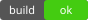

# Image policy

Local images only by default, extension-allowlisted, size-capped (docs/04).

## Allowed extensions

## Outside the allowlist — placeholder, never loaded

## Path shapes

## Remote — blocked placeholder showing the URL, default off

## A badge row, as a README would have it

  

## Image as a link target

## Empty and malformed

## Network locations wearing a path — refused, never statted

A protocol-relative URL has no scheme, so it falls through every scheme check;
a UNC path is not parsed as a URI at all. Both are an SMB connection to a host
the document chose, which is what invariant 4 forbids by default (docs/10).

